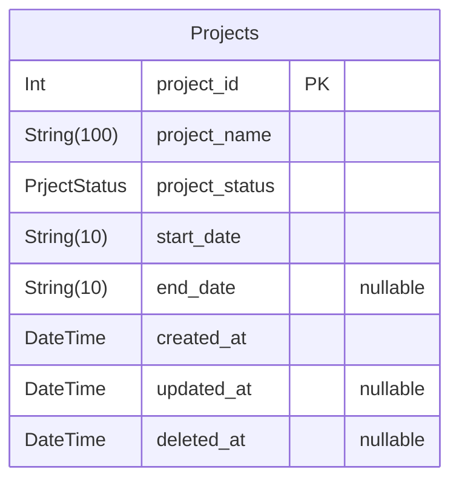
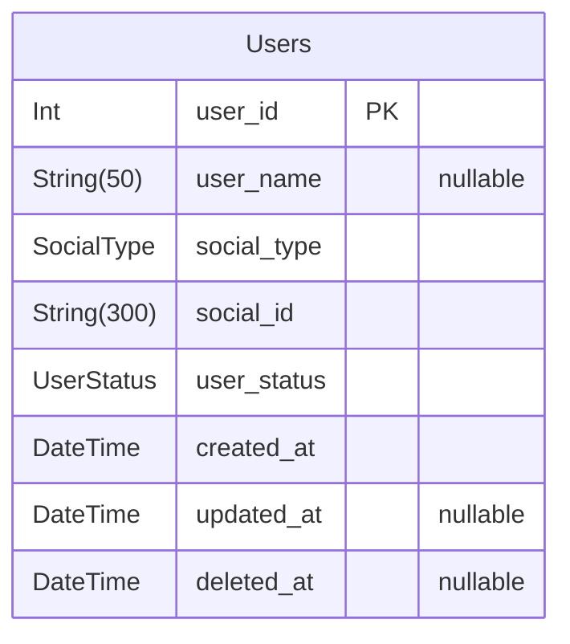

# Nestjs Fastify Practice

> Generated by [`prisma-markdown`](https://github.com/samchon/prisma-markdown)

- [Projects](#projects)
- [Users](#users)

## Projects

### `Projects`

프로젝트 모델

프로젝트 기본 정보를 담아두는 데이터 모델

Properties as follows:

- `project_id`: Primary Key
- `project_name`
  > 프로젝트명
  > 100자 제한
- `project_status`
  > 프로젝트 상태
  >
  > ACTIVE, STOP, FINISHED, DELETED
- `start_date`
  > 시작일
  > YYYY-MM-DD
- `end_date`
  > 종료일
  > YYYY-MM-DD
- `created_at`: 생성일자
- `updated_at`: 수정일자
- `deleted_at`: 삭제일자

## Users

### `Users`

유저 모델

유저 정보를 담아두는 기본적인 데이터 모델

Properties as follows:

- `user_id`: Primary Key
- `user_name`
  > 유저명
  > 50자 제한
- `social_type`
  > 소셜 로그인 타입
  >
  > KAKAO, APPLE, GOOGLE
- `social_id`
  > 소셜 로그인 아이디
  > 300자 제한
- `user_status`
  > 유저상태
  >
  > REGISTER, ACTIVE, WITHDRAW, DELETED
- `created_at`: 생성일자
- `updated_at`: 수정일자
- `deleted_at`: 삭제일자
