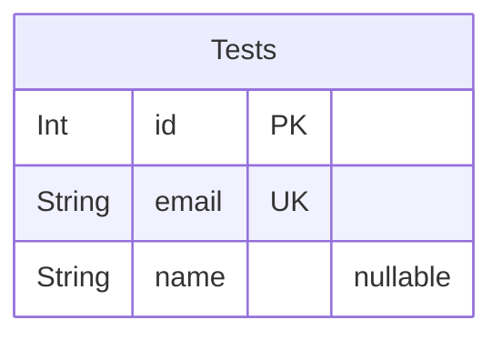

# Nestjs Fastify Practice

> Generated by [`prisma-markdown`](https://github.com/samchon/prisma-markdown)

- [Tests](#tests)
- [Actors](#actors)

## Tests

### `Tests`

Customer information, but not a person but a **connection** basis.

`drive_customers` is an entity that literally embodies the information
of those who participated in the drive system as customers. By the way,
the `drive_customers` does not mean a person, but a **connection** basis.
Therefore, even if the same person connects to the drive system multiple,
multiple records are created in `drive_customers`.
one very systematically.

Properties as follows:

- `id`: Primary Key.
- `email`:
- `name`:

## Actors

### `User`

Customer information, but not a person but a **connection** basis.

`drive_customers` is an entity that literally embodies the information
of those who participated in the drive system as customers. By the way,
the `drive_customers` does not mean a person, but a **connection** basis.
Therefore, even if the same person connects to the drive system multiple,
multiple records are created in `drive_customers`.

The first purpose of this is to track the customer's inflow path in detail,
and it is for cases where the same person enters as a non-member, reads a
[repository file](#drive_repository_files) in advance, and registers/logs
in at the moment for modification. It is the second. Lastly, it is to
accurately track the activities that a person performs at the drive system
in various ways like below.

- Same person comes from an [external service](#drive_external_users)
- Same person creates multiple [accounts](#drive_members)
- Same person makes a download with only [real name authentication](#drive_citizens)

Therefore, `drive_customers` can have multiple records with the same
[drive_citizens](#drive_citizens), [drive_members](#drive_members), and [drive_external_users](#drive_external_users).
Additionally, if a customer signs up for membership after verifying their real
name or signs up for our service after being a user of an external service,
all related records are changed at once. Therefore, identification and tracking
of customers can be done very systematically.

Properties as follows:

- `id`: Primary Key.
- `email`:
- `name`:
