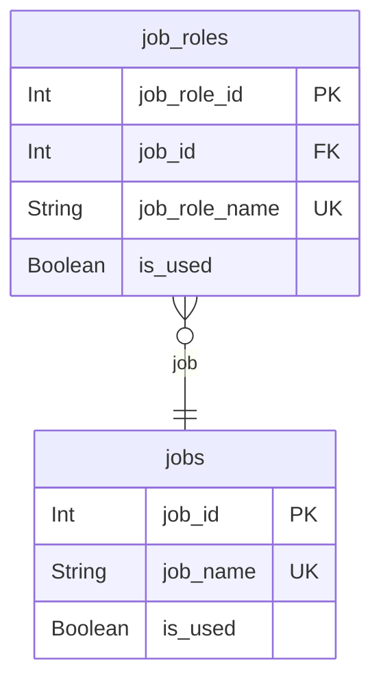
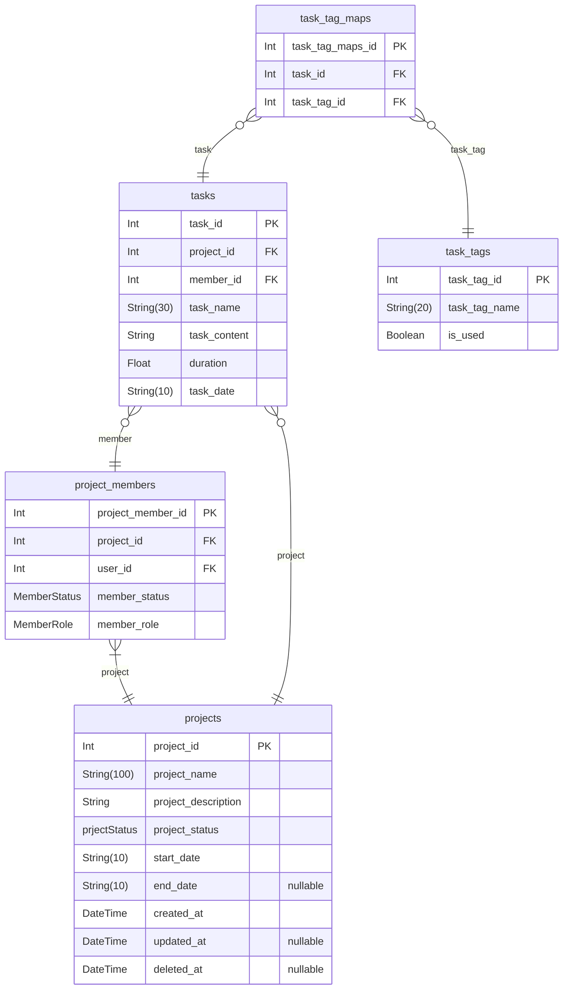
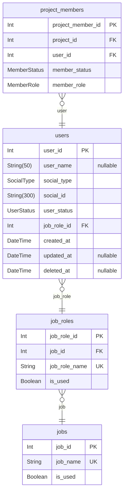
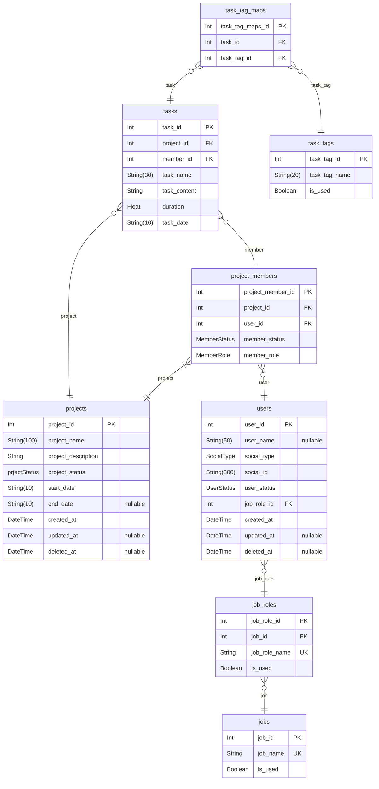

# Nestjs Fastify Practice

> Generated by [`prisma-markdown`](https://github.com/samchon/prisma-markdown)

- [Jobs](#jobs)
- [Projects](#projects)
- [Users](#users)
- [All](#all)

## Jobs

### `jobs`

직군 정보를 담고있는 데이터 모델

Properties as follows:

- `job_id`: Primary Key.
- `job_name`: 직군명
- `is_used`: 사용여부

### `job_roles`

사용자는 해당 직군테이블에 있는 데이터를 하나 선택해서 가지고 있는다.
추 후에 여러개의 직군을 가지고 있을 수도 있으니, Users테이블의 job_role_id는 대표 직군으로 인지하고 있으면 될듯 하다.
개발 초기에는 기본적으로 jobs 테이블의 직군명들을 활용하기 때문에 jobs 와 job_roles를 1:1 관계로 유지한다. 
(상세 직군을 활용하면 그때 1:N으로 변경)

Properties as follows:

- `job_role_id`: 직군 상세번호
- `job_id`: 직군번호
- `job_role_name`: 직군 상세명
- `is_used`: 사용여부

## Projects

### `project_members`

프로젝트 멤버 모델

프로젝트에 참여중인 멤버들의 정보를 담아두는 데이터 모델

Properties as follows:

- `project_member_id`: Primary Key.
- `project_id`: projects 테이블과 연결된 key
- `user_id`: users 테이블과 연결된 key
- `member_status`
  > 멤버상태
  >
  > ACTIVE, BAN
- `member_role`
  > 멤버역할
  >
  > OWNER, MEMBER

### `projects`

프로젝트 모델

프로젝트 기본 정보를 담아두는 데이터 모델

Properties as follows:

- `project_id`: Primary Key
- `project_name`
  > 프로젝트명
  > 100자 제한
- `project_description`: 프로젝트 설명
- `project_status`
  > 프로젝트 상태
  >
  > ACTIVE, STOP, FINISHED, DELETED
- `start_date`
  > 시작일
  > YYYY-MM-DD
- `end_date`
  > 종료일
  > YYYY-MM-DD
- `created_at`: 생성일자
- `updated_at`: 수정일자
- `deleted_at`: 삭제일자

### `tasks`

프로젝트 태스크 모델

프로젝트에서 진행한 작업내용을 담을 수 있는 데이터 모델
프로젝트와 프로젝트 멤버와 연결되어 있다. 

Properties as follows:

- `task_id`: Primary Key.
- `project_id`: projects와 연결된 key
- `member_id`: project_members와 연결된 key
- `task_name`: 작업명 (30자)
- `task_content`: 작업내용
- `duration`: 소요시간 (30분단위 - 0.5)
- `task_date`
  > 작업일
  > YYYY-MM-DD

### `task_tags`

태스크에 사용되는 태그 모델

Properties as follows:

- `task_tag_id`: Primary Key.
- `task_tag_name`: 작업 태그 명
- `is_used`: 사용여부

### `task_tag_maps`

태스크에서 사용되는 태그들을 모아두는 모델

Properties as follows:

- `task_tag_maps_id`: Primary Key.
- `task_id`: 작업 번호
- `task_tag_id`: 작업 태그 번호

## Users

### `users`

유저 모델

유저 정보를 담아두는 기본적인 데이터 모델

Properties as follows:

- `user_id`: Primary Key
- `user_name`
  > 유저명
  > 50자 제한
- `social_type`
  > 소셜 로그인 타입
  >
  > KAKAO, APPLE, GOOGLE
- `social_id`
  > 소셜 로그인 아이디
  > 300자 제한
- `user_status`
  > 유저상태
  >
  > REGISTER, ACTIVE, WITHDRAW, DELETED
- `job_role_id`: 선택 직군
- `created_at`: 생성일자
- `updated_at`: 수정일자
- `deleted_at`: 삭제일자

## All

